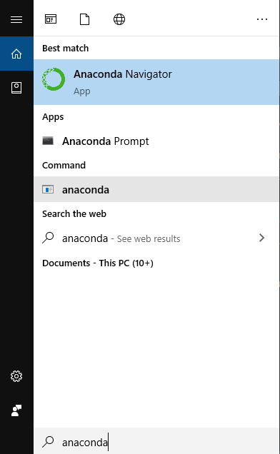

This post is an introduction to the usage of Anaconda (especially on Windows). It would useful for beginners of Anaconda and Jupyter notebook.

# What is Anaconda

Anaconda is a free and open-source distribution of the Python and R programming languages for data science and scientific computing. It aims to simplify package management and deployment.

Note that Anaconda is not merely for Python programming. You can use it for **R** and **Javascript**.

Also note that anaconda is not the only way to program in Python. You can code and run Python from terminals (such as Linux bash and Windows command line), or from other editors (such as VS Code and PyCharm). Each way has its pros and cons.

# Installation

Remember to install Anaconda with Python 3.7 (or 3.6). Follow [this link](https://docs.anaconda.com/anaconda/install/) to install. 

If Anaconda is installed correctly, you should be able to see these two items *Anaconda Navigator* and *Anaconda Prompt* in the Windows search panel, as follows:

# Starting Jupyter notebook

Jupyter notebook is an open-source web application that allows you to create and share documents that containt live code, equations, visualisations and narrative texts. Usually it is used in combination with Anaconda. Usually it is used for .ipynb files.

There are two ways to start a Jupyter notebook. Assume that you have a *hello_world.ipynb* file that is located in the path *C:\Users\Public\Documents*. You want to edit this file in Jupyter. 

## Anaconda Navigator
 
The first way is to click and start *Anaconda Navigator*. The navigator provided access to different editors. 

Then choose *Notebook*. You will see a new page opened in your browser. This page is a tree of the file system, the root node being the current user folder. 

You can navigate to the location of the *hello_world.ipynb* file. There your are.

But this way is not perfect. First, you can't go outside the root folder of the current user or another disk. Second, it is not very effective. That's why I recommend the second way.

## Anaconda Prompt

# Tips on command line